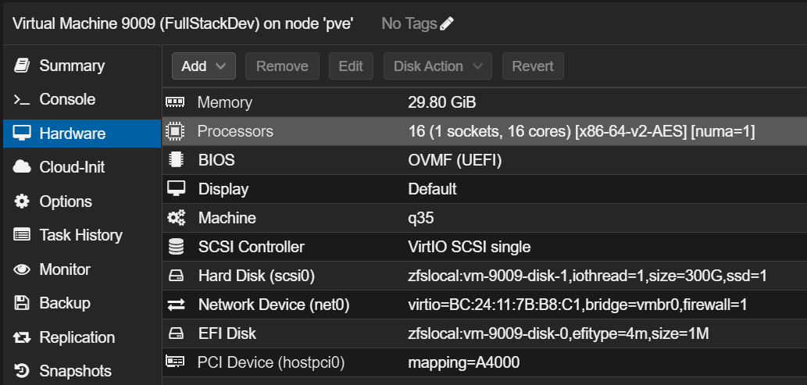

# Nvidia CUDA—version

Created: November 17, 2024 9:55 PM
Class: CASCB



- Install Ubuntu 22.04 on the VM
- Install Qemu guest agent
    
    ```powershell
    sudo apt-get install qemu-guest-agent
    sudo systemctl start qemu-guest-agent # optional
    sudo systemctl enable qemu-guest-agent
    
    # Reboot the VM 
    ```
    
    For more info visit the website : https://pve.proxmox.com/wiki/Qemu-guest-agent
    
- Install openSSH:
    
    ```powershell
    sudo apt install openssh-client
    sudo apt install openssh-server
    ```
    

- Install gcc : `sudo apt install gcc`
- Install NVIDIA CUDA toolkit from : https://developer.nvidia.com/cuda-downloads?target_os=Linux&target_arch=x86_64&Distribution=Ubuntu&target_version=22.04&target_type=deb_local
- Download the Nvidia driver.  https://ubuntu.com/server/docs/nvidia-drivers-installation
    
    I downloaded the version 560 for the nvidia driver with cuda version 12.6
    
    reboot the system and check the command :  `nvidia-smi`
    
- Download Docker engine. https://docs.docker.com/engine/install/ubuntu/
- Check the hello world container

- docker pull **nvidia/cuda:12.4.0-base-ubuntu22.04**
- docker run --name cudadeeplabcut --gpus all -dit bhargavsinhsolanki/cudadeeplabcut
- docker exec -it cudacontainer /bin/bash
- apt-get update
- apt update
- apt install git
- y
- apt-get install wget
- y
- install miniconda
- wget [https://repo.anaconda.com/miniconda/Miniconda3-latest-Linux-x86_64.sh](https://repo.anaconda.com/miniconda/Miniconda3-latest-Linux-x86_64.sh) -O /opt/miniconda-installer.sh
- bash /opt/miniconda-installer.sh
- yes
- enter
- export PATH="/root/miniconda3/bin:$PATH"
- source ~/.bashrc
- conda init
- source ~/.bashrc
- dpkg -i cuda-keyring_1.1-1_all.deb
- apt-get update
- apt-get -y install cuda-toolkit-12-4

No need to install the driver, causing error with already installed drivers.

- git clone [https://github.com/DeepLabCut/DeepLabCut.git](https://github.com/DeepLabCut/DeepLabCut.git)
- conda env create -f DeepLabCut/conda-environments/DEEPLABCUT.yaml
- conda activate DEEPLABCUT
- **conda install anaconda::tensorflow-gpu**
- **conda  install anaconda::numpy=1.23.5**
- **conda install chardet**

**NVIDIA CUDA Installation Guide for Linux:

Pre-installation Action:**

Install all the Ubuntu driver (suto install) as it uses the most suitable driver for the GPU, last trials showed some errors.

Download the CUDA toolkit 12.4 from the